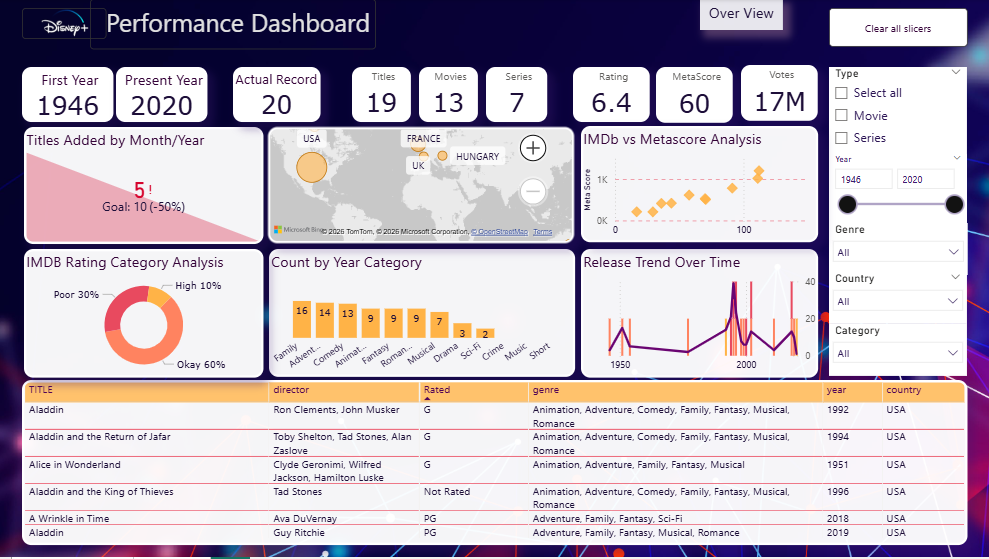

# Disney+ Shows Analysis
This dataset summarizes Disney+ movies and series, quantifying the content library and providing specific details for each entry.

# <h2>Project overview</h2>

  This project is about analysis of the Disney plus shows. We want to see how all the movies and series are good, who made it and who is in it. Focusing on understanding the rating, and trends of movies and series available on the platform. The analysis utilizes a metadata-rich dataset comprising key film attributes such as IMDB ratings, voting, release years, genres, directors, writer, and actors. We are using Excel and Power Bi to look at all this information.

# <h2>Tools & Technologies
Microsoft Excel – Data cleaning and preprocessing   Power BI – Data modelling and visualization

# <h2>Data Source

Dataset: disney_plus_shows  
Headers: imdb_id, title, plot, type, rated, year, released_at, added_at, runtime, genre, director, writer, actors, language, country, awards, metascore, imdb_rating, imdb_votes.

# <h2>Data Preparation: Excel

The Disney+ shows dataset was cleaned and transformed using Power Query in Excel. Empty cells across all columns were replaced with null values to standardize missing data. Duplicate records were eliminated by verifying the uniqueness of each imdb_id, maintaining a clean dataset. Null values in the plot, director, and writer columns were standardized using 'No description' and 'Unknown' as default replacements. To normalize the dataset, multi-value fields (e.g., genre and runtime) were split by delimiters and transformed from columns into individual rows. Data types were accurately assigned, with date columns formatted as dates and ratings as decimals. Custom columns were added to look at the content lifecycle, such as "Years to add," "Years since released," and "Years on Disney." We sorted the content by release year (Old, Mid, Recent, New) and IMDb rating (Excellent, Amazing, High, etc.). In Excel, conditional formatting was used to highlight differences between the year and released_at, as well as metascore ratings. This made it easier to quickly analyze the data visually.

# <h2>Data Modeling: Power BI

The analysis was performed by importing Excel data into Power BI. Using DAX, measures were created to aggregate total movies, series, and identify the present year within the dataset. Visualizations include cards for summary statistics, slicers for dynamic filtering, and various charts like scatter plots, donut charts, and column charts to analyze relationships and distributions. A table visual was created to display the top-rated titles, with a relationship established between the rowdata_disney_plus_shows and disney_plus_shows tables based on the imdb_id column, using a one-to-many cardinality, and filtered to show the top five titles by sum of IMDb ratings. To improve the user experience, we prioritized interactivity by configuring custom tooltips and intuitive filter settings. 

<b> In Power BI</b>, custom DAX measures were created for dynamic calculations:

* <b>Present Year</b> = MAX (disney_plus_shows[Released_at].[Year])
* <b>Total Movie</b> = CALCULATE (DISTINCTCOUNT(disney_plus_shows[IMDB ID]), disney_plus_shows[Type]="Movie" )+0
* <b>Total Series</b> = CALCULATE(DISTINCTCOUNT(disney_plus_shows[IMDB ID]), disney_plus_shows[Type]="Series")+0
* <b>Target Title</b> = 10

# <h2>Key Insights

* The dataset features both movies and series, with total counts showing the variety of content available on Disney+.
* Most titles receive high IMDb ratings, with a significant number rated as "Okay".
* Disney+ content has increased significantly over time, showing platform growth.
* certain genres perform better in terms of critical scores. 
* High-rated titles tend to have strong IMDb scores and metascores, reflecting quality content.
* A few countries dominate Disney+ content production.

# <h2>Files Included
* `disney_plus_shows.csv` - The original raw dataset.
* `Aswathy.P.M_D41_MiniProject_Excel.xlsx` - The cleaned dataset used for modeling.
* `Aswathy.P.M_D41_MiniProject_PowerBi.pbix` - The Power BI project file.
* `Dashboard_1501.png` & `Dashboard_1502.jpg` - Images of the final dashboard.

